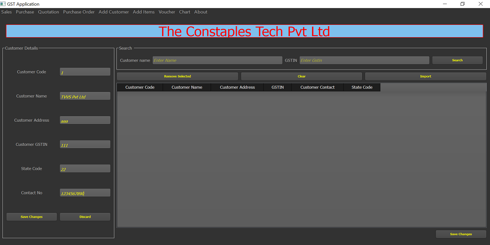
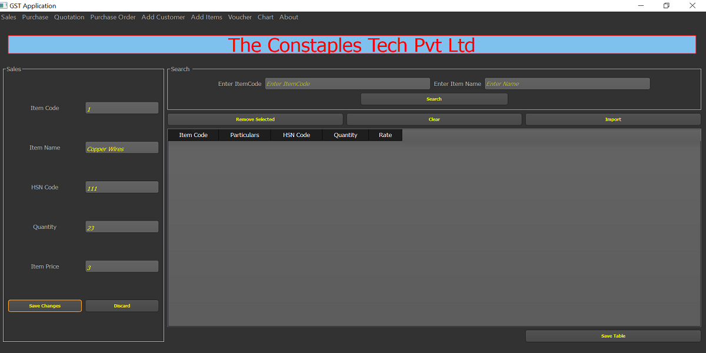
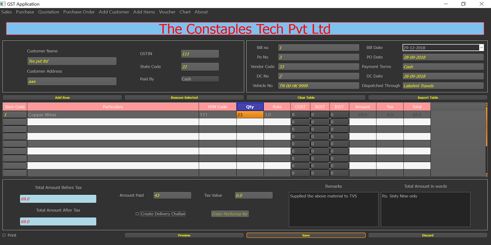
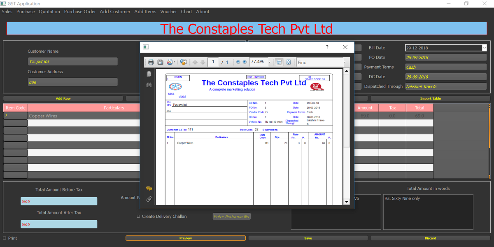
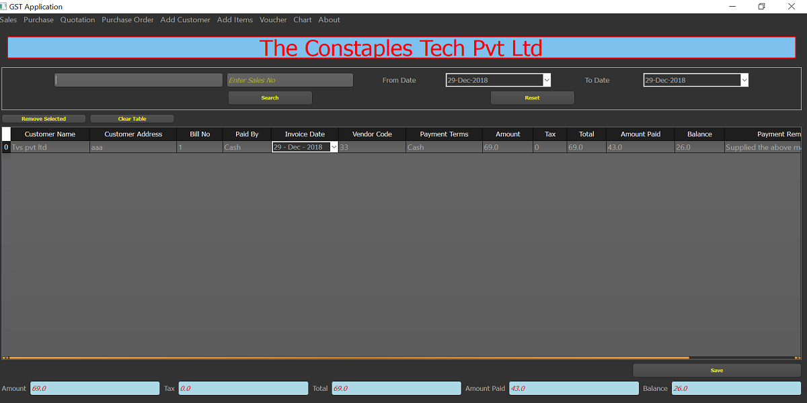
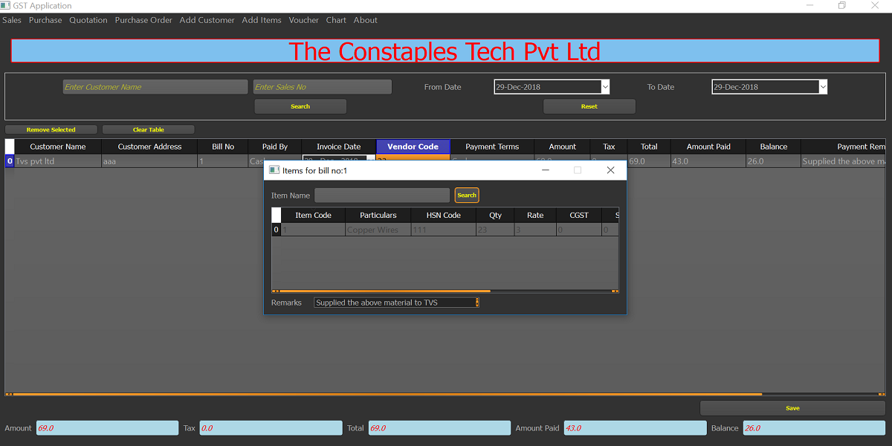
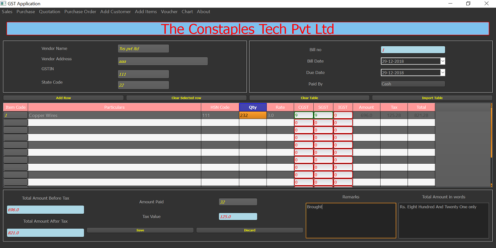
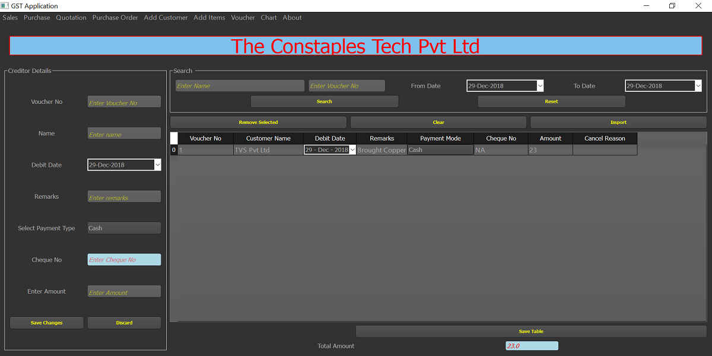
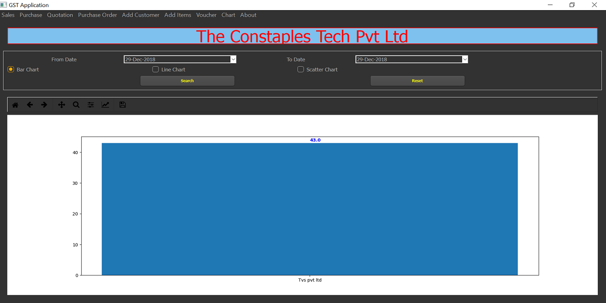

GST Application
===============

A simple PySide Application to store, retrieve, display and create PDF
for sales and purchase information for small scale industries. This
application uses MongoDB as database if mongo server is available or
switches to SQLite.

Prerequiste:

-   Python
-   PySide
-   Pandas
-   MatplotLib
-   MongoEngine (If Mongo server is available) or Peewee (for SQLite)

Launch
:   Run **python launcherApplication.py**

PDF Settings:

Launch
:   -   Press *shift+alt+s* to launch PDF Settings dialog
    -   Enter user company Details like Company name, address, tag,
        gstin, state-code
    -   Also enter settings for PDF

Add Customer

> 
>
> -   Select Add Customer
> -   Enter Customer Details to populate easily in other widgets

Add Items

> 
>
> -   Select Add Items
> -   Enter Item Details to populate easily in other widgets

Sales Bill

> 
>
> -   Select Sales bill
> -   Enter Customer Name, if Customer Name is already entered in add
>     customer widgets it will auto populate address, GSTIN and state
>     code
>
> 
>
> -   Else on click of preview/save customer dailog pops up to save new
>     customer entry.
> -   Enter items in table, if already entered in add items, it auto
>     populates name, price
> -   After entering all fields select preview to view pdf to be
>     generated
> -   Enter Performa no if it is already entered and saved to auto
>     populate entire sales information
> -   Click on save to save sales entry
> -   Press *ctrl + s* to save the information
> -   Press *ctrl + r* tp restore the saved widget information

Sales Report

> 
>
> -   View saved sales information, search through customer name or by
>     setting dates
> -   Edit the information needed and create new pdf for the bill edited
> -   Export the saved information to excel
>
> 
>
> -   View Items saled for the particular bill no

Purchase

> 
>
> -   Enter all the expenses or purchase information

Voucher

> 
>
> -   Enter/View the voucher information for credit/debit

Chart
:   

    -   View the sales/purchase information or sales/purchase item
        information in graphical represention(Bar, Line or Scatter plot)

Others:
:   Basic introduction to model/view architecture in Pyside for
    QTablemodel

